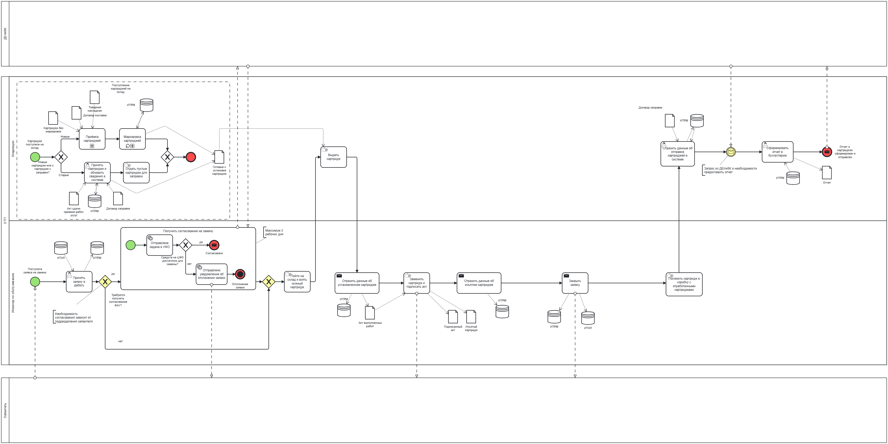
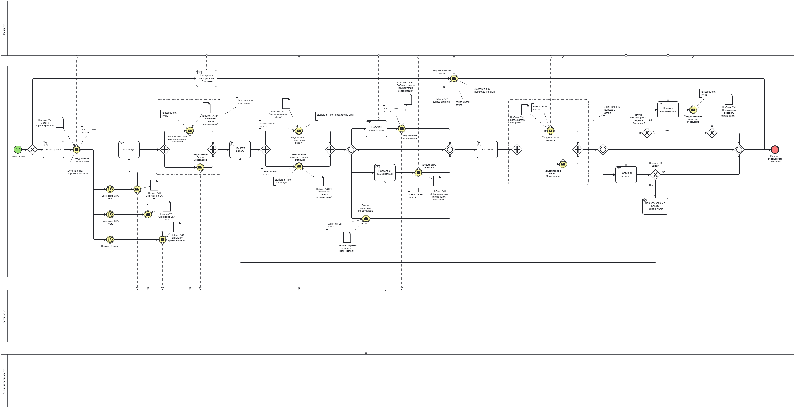
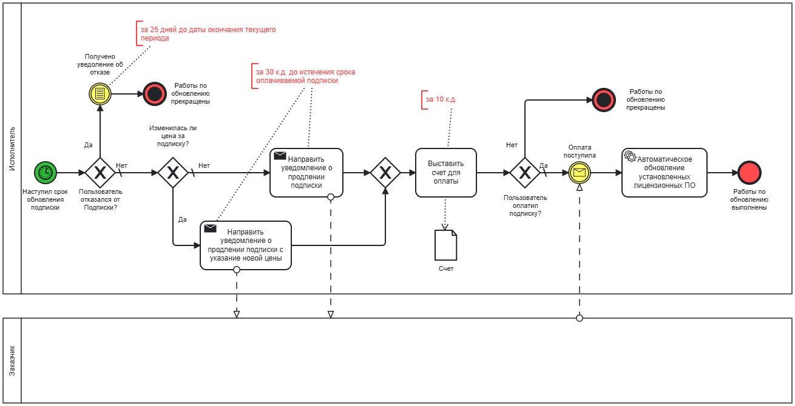
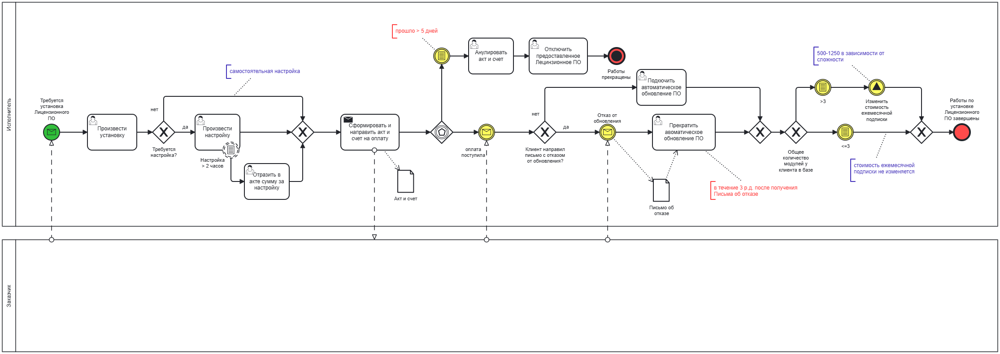

# My portfolio
## Системный аналитик 1С | System Analyst 1C
Привествую вас в моём портфолио. Меня зовут Околович Анастасия, я системный аналитик с опытом 4 года. Область моей проффесиональной деятельности на данный момент - 1С.
От технической поддержки до разработки новой конфигурации.

Здесь вы увидите выжимки из моих технических заданий для разработчиков, различные диаграммы в двух нотация, а также мой мини-пэт проект.

## Технологический стек:
1С, BPMN,UML, API(REST),Postman,SQL.

## 📊 Диаграммы (BPMN & UML)
Здесь представлены диаграммы в нотации BPMN, а также в UML по различным кейсам.

### 1. Процесс замены картриджа
**AS-IS**  

**TO-BE**

### 2. Рассылка уведомлений (Запроса на обслуживание)
**AS-IS** 

**TO-BE**

### 3. Работа с заявкой по договору

### 4. Процесс продления подписки на обслуживание

### 5. Установка лицензионного ПО

### 6. Движение заявки

### 7. Оплата кредитной картой (sequence diagram)

## 🏠 Кейсы & проекты
Примеры моих технических заданий, пользовательских инструкций, а также реальные кейсы с собеседований (как я их решила).

**Разработка нового механизма учета аналогов моделей картриджей для системы учета расходных материалов (1С):**
- [Учет аналогов картриджей](./docs/cartridge-model-analogs-accounting.pdf)

### 1️⃣ Кейс: База данных покупки квартиры (собеседование)
**Задача:** Спроектировали схему БД для учета недвижимости
- ERD диаграмма
- ТЗ → схема → оптимизация
- [Код SQL / диаграмма]

### 2️⃣ WorkBuddy Bot (пет-проект)
### Telegram-бот "WorkBuddy" для поиска вакансий (Python + Telegram Bot API + HH.ru API)

### Описание проекта:
Пет-проект: автоматизированный поиск вакансий на HH.ru с фильтрацией по ключевым словам.
Основные возможности:
•	Свежие вакансии (созданные <24ч) — /recent_vacancies 
•	Актуальные вакансии — /vacancies 
•	Рассылка по расписанию (настраивается в чате, хранится в SQLite) — /settings_notifications

### Ключевые технологии и навыки:
- Python (`python-telegram-bot`, `requests`, `schedule`) 
- HH.ru API (аутентификация, Postman-тесты, JSON-парсинг) 
- SQLite (настройки пользователей, история) 
- Деплой на Amvera (production 24/7)

### Моя роль и достижения:
- Полная разработка команд + парсинг API 
- Тестирование endpoints в Postman, интеграция access token 
- Развертывание на Amvera 
- ИИ (Perplexity AI): отладка SQL/API — ускорило на 40% 
- Тестирование на себе/семье
  
## 📊 Диаграммы WorkBuddy Bot
### 🏗️ Архитектура системы

### 🔍 Поиск свежих вакансий (/recent_vacancies)

### Результат:
Рабочий бот в проде на Amvera. Персонализированная рассылка вакансий по расписанию.
Демо: [@get_my_job_bot].

