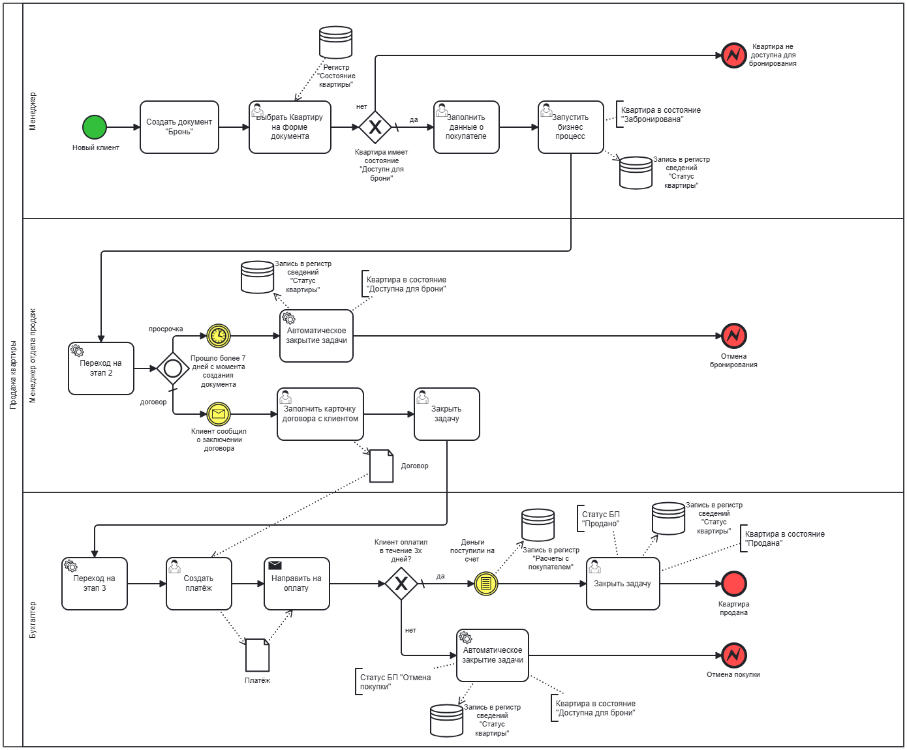

# My portfolio
# Системный аналитик 1С | System Analyst 1C
**Околович Анастасия**  
*4 года: от техподдержки → разработка конфигураций*
⚙️ 1C: конфигурации, регистры, бизнес-процессы
📊 UML/BPMN диаграммы (PlantUML, draw.io)
📋 Тех. документация + инструкции
🗄️ SQL запросы + оптимизация

# Технологический стек:
| Область | Нотации/Технологии | Инструменты |
|---------|-------------------|-------------|
| **Системы** | 1C (объекты конфигурации, консоль запросов) | - |
| **Диаграммы** | BPMN, UML | PlantUML, draw.io |
| **Базы данных** | SQL | DBeaver |
| **Интеграции** | REST API | Postman |

# 📊 Диаграммы (BPMN & UML)
Здесь представлены диаграммы в нотации BPMN/UML по различным кейсам.

### 1. Процесс замены картриджа
**AS-IS**  

**TO-BE**

### 2. Рассылка уведомлений (Запроса на обслуживание)
**AS-IS** 

**TO-BE**

### 3. Работа с заявкой по договору

### 4. Процесс продления подписки на обслуживание

### 5. Установка лицензионного ПО

### 6. Движение заявки

### 7. Оплата кредитной картой (sequence diagram)

# 🎯 Кейсы & проекты
Здесь представлены примеры написанной мной документации, реальные кейсы и пэт-проекты.

## 📄 Документация 
**1. Разработка нового механизма учета аналогов моделей картриджей для системы учета расходных материалов (1С):**
- [Учет аналогов картриджей](./docs/cartridge-model-analogs-accounting.pdf)

**2. Добавление кнопки по проверки подписи (1С+API ЕПГУ):**
- [Валидация подписи](./docs/signature-validation-button.pdf)  

**3. Пользовательская инструкция (выжимка):**
- [Пользовательская инструкция](./docs/user-instruction.pdf)

## 💼  Кейсы
**1.База по продаже квартиры**
*Задание с собеседования (формулировки мои).*

**Задача:** Пустая база. Разработать структуру конфигурации для продажи квартир: менеджеры вносят квартиры, бронируют на 7 дней, если договор не был заключен в рамках времени, то бронь отменяется. После заключения договора -> оплата (один платёж для простоты). Оплата должна быть проведена не поздней 3х дней с момента заключения договора.

### Решение:
**Объекты конфигурации 1C**

*Справочники • Документы • Перечисления*
| Тип | Объекты |
|-----|---------|
| **Справочники** | Квартиры (адрес, площадь, цена) |
| **Документы** | Бронь, Договор, Платеж |
| **Перечисления** | СостояниеКвартиры |

*Регистры*
| Название | Тип | Подчинение | Ресурсы | Измерения |
|----------|-----|------------|---------|-----------|
| **СостояниеКвартиры** | сведений, периодический | Бронь, Платёж | СостояниеКвартиры | квартира |
| **РасчетыСПокупателями** | накопления, обороты | Платеж | цена | квартира |

*Бизнес-процесс*
ПродажаКвартиры
- Бронь (7 дней)
- Договор
- Оплата

**Точки маршрута Бизнес-процесса**

| Этап | Исполнитель | Задача | Срок | Условие перехода | Действие с регистром |
|------|-------------|--------|-------|------------------|---------------------|
| **1. Старт: Бронь** | Менеджер | Заключить договор | 7 дней | Проведён `Договор` | Запись: "Забронирована" |
| **2. Договор** | Менеджер продаж | Заключить договор | - | Существует `Договор` | Проверка брони |
| **3. Оплата** | Бухгалтер | Зафиксировать платёж | 3 дня | Проведён `Платеж` | Запись: "Продана" |

**Диаграмма:**

**Результат:**  
✅ **Полная автоматика** статусов через регистр + БП  
✅ **Предотвращение дублей** бронирования  
✅ **Контроль сроков** с авто-отменой  
✅ **Интеграция** Документы ↔ Регистры ↔ Бизнес-процессы
✅ **Отчетность** Наличие регистров позволяет настраивать гибкие отчеты для руководства

## 🧑‍💻    Пет-проекты
### Telegram-бот "WorkBuddy" для поиска вакансий (Python + Telegram Bot API + HH.ru API)

### Описание проекта:
Пет-проект: автоматизированный поиск вакансий на HH.ru с фильтрацией по ключевым словам.
Основные возможности:
- Свежие вакансии (созданные <24ч) — /recent_vacancies
- Актуальные вакансии — /vacancies
- Рассылка по расписанию (настраивается в чате, хранится в SQLite) — /settings_notifications

### Ключевые технологии и навыки:
- Python (`python-telegram-bot`, `requests`, `schedule`) 
- HH.ru API (аутентификация, Postman-тесты, JSON-парсинг) 
- SQLite (настройки пользователей, история) 
- Деплой на Amvera (production 24/7)

### Моя роль и достижения:
- Полная разработка команд + парсинг API 
- Тестирование endpoints в Postman, интеграция access token 
- Развертывание на Amvera 
- ИИ (Perplexity AI): отладка SQL/API — ускорило на 40% 
- Тестирование на себе/семье
  
## 📊 Диаграммы WorkBuddy Bot
### 🏗️ Архитектура системы

### 🔍 Поиск свежих вакансий (/recent_vacancies)

### Результат:
Рабочий бот в проде на Amvera. Персонализированная рассылка вакансий по расписанию.

Демо: [@get_my_job_bot].

##  📞 Контакты
**Telegram:** @okssiaa
**Email:** anastasia-okolovitch@yandex.ru
**HH:** https://vladivostok.hh.ru/resume/3f7ac94bff0fbdd2990039ed1f33464f73434c
